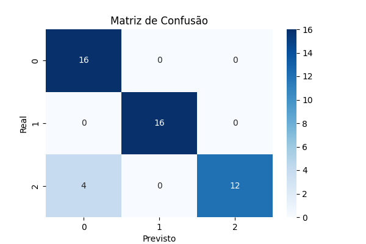

# Análise de Sentimentos com Machine Learning

## Descrição

Este projeto tem como objetivo desenvolver um modelo de Machine Learning capaz de classificar textos em sentimentos positivos e negativos. Para isso, foram aplicadas técnicas de Processamento de Linguagem Natural (NLP), pré-processamento de textos e algoritmos de aprendizado supervisionado utilizando a biblioteca Scikit-Learn.

## Objetivos

- Realizar a limpeza e preparação dos dados textuais;
- Aplicar técnicas de vetorização de texto;
- Normalizar os dados para melhorar o desempenho do modelo;
- Treinar um classificador utilizando Regressão Logística;
- Avaliar o desempenho através de métricas de classificação;
- Utilizar validação cruzada para verificar a capacidade de generalização do modelo;
- Analisar possíveis sinais de overfitting.

## Tecnologias Utilizadas

- Python
- Google Colab
- Pandas
- NumPy
- Matplotlib
- Seaborn
- Scikit-Learn

## Etapas do Projeto

### 1. Coleta e Preparação dos Dados
- Criação e organização do conjunto de dados;
- Verificação de valores nulos;
- Padronização dos textos;
- Remoção de caracteres especiais.

### 2. Vetorização e Normalização
- Aplicação do TF-IDF para representação numérica dos textos;
- Normalização dos dados utilizando Normalizer.

### 3. Treinamento do Modelo
- Separação entre dados de treino e teste;
- Treinamento utilizando Logistic Regression.

### 4. Validação Cruzada
- Aplicação do método Cross Validation (5 folds);
- Comparação dos resultados para verificar a estabilidade do modelo.

### 5. Avaliação
As seguintes métricas foram utilizadas:

- Accuracy
- Precision
- Recall
- F1-Score
- Matriz de Confusão

## Matriz de Confusão

## Resultados

Os resultados demonstraram que o modelo foi capaz de identificar corretamente a maior parte dos sentimentos presentes nos textos analisados.

A validação cruzada apresentou resultados semelhantes aos obtidos no conjunto de teste, indicando boa capacidade de generalização.

## Discussão sobre Overfitting

A comparação entre os resultados da validação cruzada e do conjunto de teste não apresentou diferenças significativas. Isso sugere que o modelo não sofreu overfitting relevante e conseguiu generalizar adequadamente para novos dados.

Caso houvesse uma diferença muito grande entre desempenho de treino e teste, seria um forte indicativo de sobreajuste.

## Conclusão

O projeto permitiu aplicar conceitos fundamentais de Machine Learning e Processamento de Linguagem Natural na construção de um sistema de análise de sentimentos.

As etapas de preparação dos dados, vetorização, normalização, treinamento e avaliação demonstraram a importância de cada fase para obtenção de modelos mais confiáveis e precisos.

Os resultados obtidos evidenciam que a Regressão Logística é uma abordagem eficiente para tarefas de classificação de textos, apresentando bom desempenho e capacidade de generalização.

## Integrantes

- Dandhara David — RA: 2025116147
- Mariane Souza — RA: 2025115214
- Leonardo Sena — RA: 2025114026
